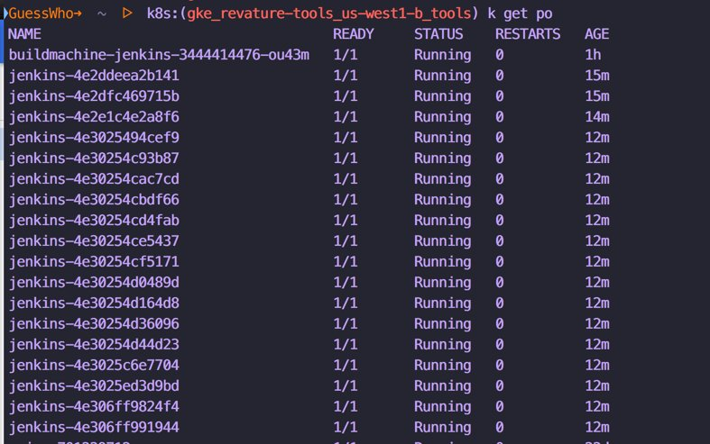
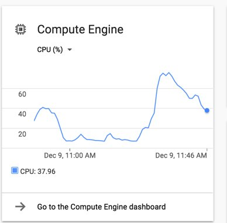
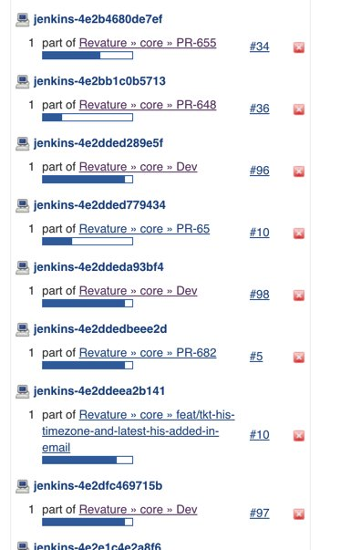

#Look ma Jenkins with Kubernetes in Production

Use Jenkins and Kubernetes the powerful container automation framework for CI. In this talk  will be sharing how to use the kubernetes to dynamically scale slaves/node for CI , reduce your cost and have faster builds. All of this is using  code and which is reproducible across environment.  

Tools used :-Kubernetes, Helm, Docker, Jenkins Pipeline, GKE

